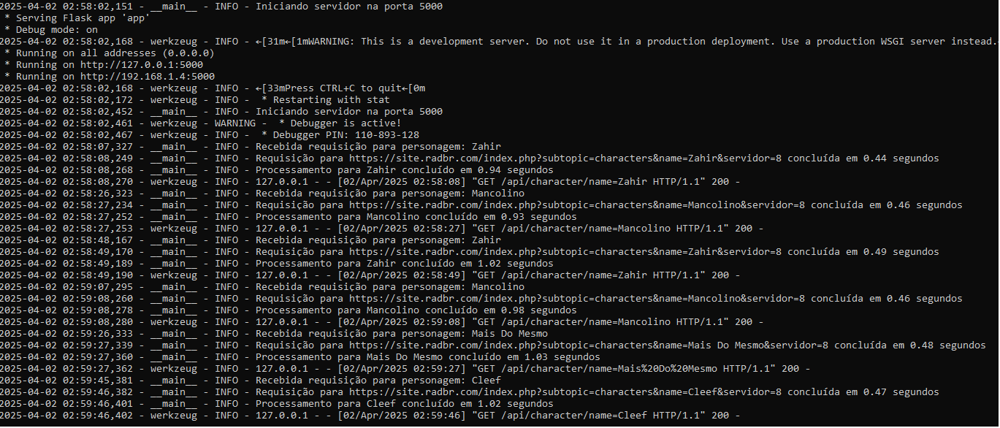

# Sistema de Monitoramento de Personagens RadBR

Este sistema consiste em um conjunto de serviços para monitorar o status de personagens no jogo RadBR e enviar notificações em tempo real quando eles ficam offline.



## Arquitetura

O sistema é composto por três componentes principais:

1. **API Flask (app.py)** - API REST que consulta o site do RadBR para obter informações atualizadas de personagens
2. **Serviço de Monitoramento (requi.py)** - Script que verifica periodicamente o status dos personagens e envia notificações
3. **API Node.js** (externa) - Serviço que recebe as requisições de notificação e envia mensagens

## Recursos Implementados

O sistema inclui os seguintes recursos de resiliência e observabilidade:

- **Circuit Breaker**: Interrompe temporariamente as requisições após múltiplas falhas, prevenindo sobrecarga de serviços já comprometidos
- **Retry com Backoff Exponencial**: Realiza múltiplas tentativas com tempo crescente entre elas para contornar falhas temporárias
- **Timeout**: Limita o tempo de espera das requisições para evitar bloqueios indefinidos
- **Logging**: Registra eventos, erros e tempos de resposta para diagnóstico
- **Monitoramento**: Heartbeats e verificações de saúde periódicas
- **Tratamento de Erros**: Lida com diferentes tipos de falhas de maneira adequada
- **Whitelist**: Evita notificações repetitivas com um sistema de espera para personagens offline

## Detalhes de Implementação

### Circuit Breaker
- Monitora falhas consecutivas em cada serviço (APIs Flask e Node)
- Quando atinge 5 falhas consecutivas, "abre o circuito" bloqueando requisições por 5 minutos
- Permite que serviços indisponíveis se recuperem sem sobrecarga adicional
- Implementado como classe própria com estados e controle de tempo

### Sistema de Retry
- Configurado para 3 tentativas por padrão
- Tempo entre tentativas aumenta exponencialmente: 0.3s, 0.6s, 1.2s
- Foca em códigos de erro específicos (500, 502, 503, 504)
- Implementado usando a biblioteca urllib3.util.Retry

## Requisitos

- Python 3.7+
- Node.js 14+ (para a API externa)
- Bibliotecas Python (instale com `pip install -r requirements.txt`):
  - Flask
  - requests
  - beautifulsoup4
  - urllib3

## Como Executar

### 1. Inicie a API Flask

```bash
python app.py
```

A API Flask estará disponível em `http://localhost:5000`.

### 2. Inicie seu serviço Node.js (API de mensagens)

Certifique-se de que sua API Node.js esteja rodando em `http://localhost:8000`.

### 3. Execute o serviço de monitoramento

```bash
python requi.py
```

## Endpoints da API

### API Flask

- `GET /api/character/name=<character_name>` - Obtém informações de um personagem em tempo real
- `GET /health` - Verifica a saúde da API

### API Node.js (Externa)

- `POST /messagem` - Envia uma mensagem de notificação

## Arquivos de Log

- `app.log` - Logs da API Flask
- `requi.log` - Logs do serviço de monitoramento

## Configurações

As configurações principais podem ser ajustadas no início dos arquivos:

- **app.py**: Número de retries, timeout de requisições
- **requi.py**: 
  - `CIRCUIT_BREAKER_THRESHOLD`: Número de falhas para ativar o circuit breaker (padrão: 5)
  - `CIRCUIT_BREAKER_TIMEOUT`: Tempo em segundos para resetar o circuit breaker (padrão: 300)
  - `CHECK_INTERVAL`: Tempo entre verificações em segundos (padrão: 10)
  - `MAX_RETRY_API_FLASK` e `MAX_RETRY_API_NODE`: Número de tentativas para cada API

## Solução de Problemas

- Verifique os arquivos de log para identificar erros
- Confirme que todas as APIs estão funcionando corretamente
- Verifique as conexões de rede entre os serviços
- Se o circuit breaker estiver ativo, aguarde o período de timeout ou reinicie o serviço

## Monitoramento

O sistema implementa um heartbeat básico a cada minuto e verificações de saúde periódicas da API Flask. 